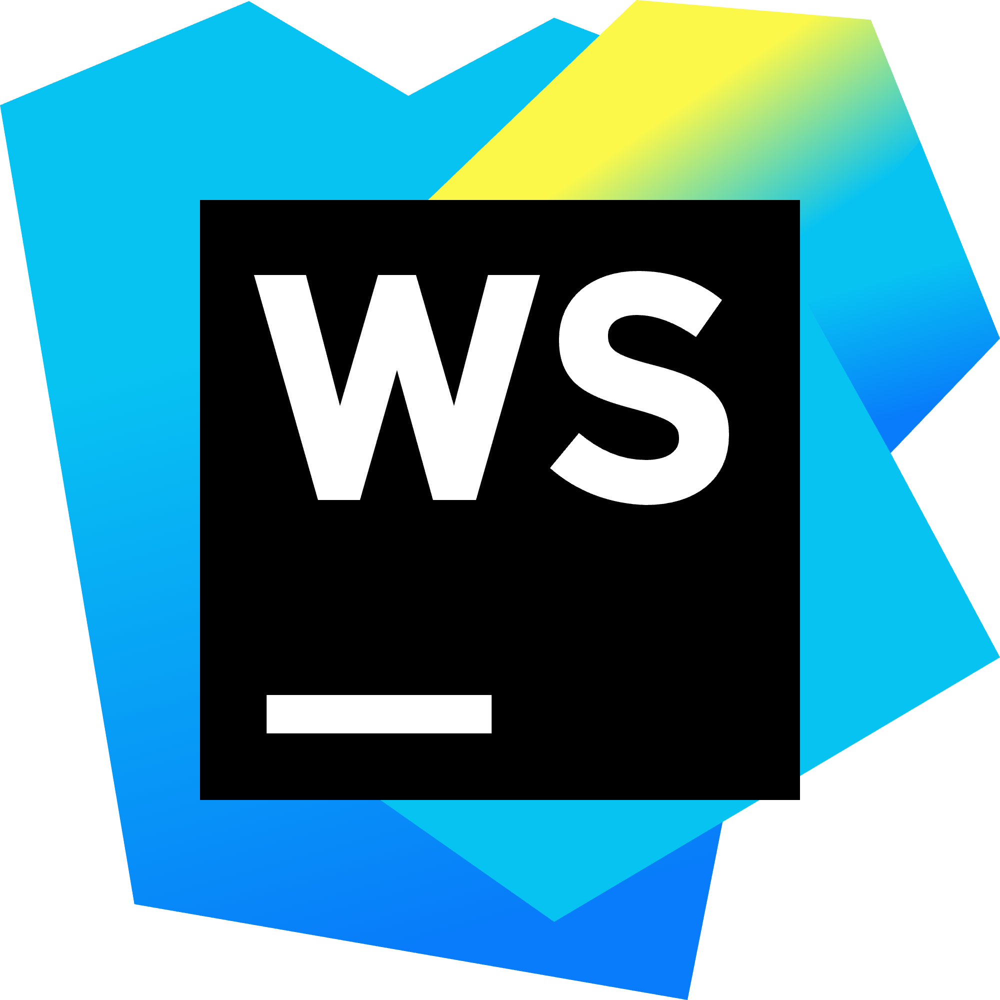

# svg下载

Webstorm官网 的图标就不能下载，看了下代码原来是 svg的 还不能保存， 好好好，那就自己写一个吧 废话不多 直接上代码

<div :class="$style.icons">
    <div>
    <a-tooltip title="svg">
             <svg>
                <use xlink:href="#webstorm"></use>
                <symbol id="webstorm" fill="none" viewBox="0 0 70 70" xmlns="http://www.w3.org/2000/svg">
                    <defs>
                        <linearGradient id="webstorm_webstorm_svg__a" gradientUnits="userSpaceOnUse" x1="25.068" x2="43.183"
                                        y1="1.46"
                                        y2="66.675">
                            <stop offset=".285" stop-color="#07C3F2"></stop>
                            <stop offset=".941" stop-color="#087CFA"></stop>
                        </linearGradient>
                        <linearGradient id="webstorm_webstorm_svg__b" gradientUnits="userSpaceOnUse" x1="30.72" x2="61.365"
                                        y1="9.734"
                                        y2="54.671">
                            <stop offset=".14" stop-color="#FCF84A"></stop>
                            <stop offset=".366" stop-color="#07C3F2"></stop>
                        </linearGradient>
                        <linearGradient id="webstorm_webstorm_svg__c" gradientUnits="userSpaceOnUse" x1="61.082" x2="65.106"
                                        y1="15.29"
                                        y2="29.544">
                            <stop offset=".285" stop-color="#07C3F2"></stop>
                            <stop offset=".941" stop-color="#087CFA"></stop>
                        </linearGradient>
                    </defs>
                    <path d="M9.406 63.292 0 7.365 17.427.073l11.156 6.635L38.792 1.24l21.291 8.166L48.125 70 9.406 63.292Z"
                          fill="url(#webstorm_webstorm_svg__a)"></path>
                    <path d="M70 23.698 60.958 1.385 44.552 0 19.25 24.281l6.854 31.354 12.688 8.896L70 46.011l-7.656-14.292L70 23.698Z"
                          fill="url(#webstorm_webstorm_svg__b)"></path>
                    <path d="m56 20.344 6.344 11.375L70 23.698 64.385 9.844 56 20.344Z"
                          fill="url(#webstorm_webstorm_svg__c)"></path>
                    <path d="M56 14H14v42h42V14Z" fill="#000"></path>
                    <path d="M34.417 48.65h-15.75v2.683h15.75V48.65ZM34.16 19.25l-2.38 9.17-2.66-9.17h-2.66l-2.66 9.17-2.38-9.17h-3.64L22.26 35h2.94l2.59-9.1 2.52 9.1h3.01l4.48-15.75h-3.64ZM38.5 32.76l2.03-2.45c1.4 1.19 2.94 1.89 4.69 1.89 1.4 0 2.31-.56 2.31-1.47v-.07c0-.91-.56-1.33-3.15-2.03-3.15-.84-5.25-1.68-5.25-4.83v-.07c0-2.87 2.31-4.76 5.53-4.76 2.31 0 4.27.7 5.88 2.03l-1.82 2.59c-1.4-.98-2.8-1.54-4.13-1.54s-2.03.63-2.03 1.4v.07c0 1.05.7 1.4 3.43 2.1 3.22.84 5.04 1.96 5.04 4.76v.07c0 3.15-2.38 4.9-5.81 4.9-2.45-.07-4.83-.91-6.72-2.59Z"
                          fill="#FFF"></path>
                </symbol>
            </svg>
    </a-tooltip>
    </div>
       <p> ---> </p>
    <div>
    <a-tooltip title="png">
        
    </a-tooltip>
    </div> 
</div>

<script setup>
import { withBase, useData } from 'vitepress';
const webstormUrl = withBase('webstorm.png');
console.log(webstormUrl);
const { theme } = useData()
</script>

<style module lang="less">
.icons {
    display: flex;
    justify-content: center;
    align-items: center;
    p {
    margin: 0 7rem;
    }
    svg{
        width: 150px;
    }

    img {
        width:150px;
        height: 150px;
    }
}
</style>

```js
   /**
 * 把 svg 转换 png
 * @param svgElement
 * @param width
 * @param height
 */
function convertSvgToPng(svgElement, width, height, callback) {
    const canvas = document.createElement('canvas');
    canvas.width = width;
    canvas.height = height;
    const ctx = canvas.getContext('2d');

    // 将 SVG 转换成 DataURL
    const data = new XMLSerializer().serializeToString(svgElement);
    const svg = new Blob([data], {type: 'image/svg+xml;charset=utf-8'});
    const url = URL.createObjectURL(svg);

    const img = new Image();
    img.onload = function () {
        ctx.drawImage(img, 0, 0);
        URL.revokeObjectURL(url);
        const png = canvas.toDataURL('image/png');
        callback(png);
    };
    img.src = url;
}

document.querySelector('#app').addEventListener('click', starts)

function starts() {
    const svg = document.querySelector('svg');
    convertSvgToPng(svg, 2000, 2000, function (png) {
        const img = document.createElement('img');
        // 缩小
        img.src = png;
        img.style.width = '100px'
        img.style.height = '100px'
        document.body.appendChild(img);
    });
}
```
